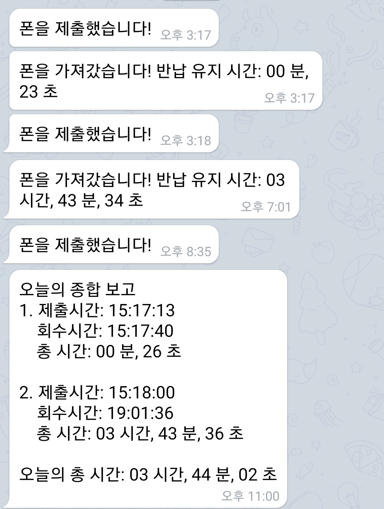

# get-rid-of-your-phone
동생은 폰을 내지 않으면 공부를 안한다. 동생 폰 제출 프로젝트

## 1. 프로젝트 개요
동생이 입시철인데 공부를 안한다. 그 이유를 알아보니 바로 스마트폰....  
부모님과 함께 동생의 스마트폰 사용량을 줄이게 하기 위한 방법을 강구하던 중...  
바로 이 프로젝트가 탄생하게 되었다.

    동생의 폰 사용량 줄이기

## 2. 목표
핸드폰을 제출하게 만들자
### 2.1. 핸드폰을 제출, 가져가면 알람이 울리게
폰 제출함을 제작하였다. 아크릴 주문제작하였으며, 하단의 버튼을 통해 핸드폰의 무게를 감지한다.


버튼은 라즈베리파이의 GPIO와 연결되어있어서, 핀에 흐르는 전류의 세기를 통해 핸드폰 제출여부를 파악할 수 있다.

### 2.2. 메신저로 알람이 가게
핸드폰을 제출하거나, 다시 가져갈 때 마다 부모님의 핸드폰으로 알람이 간다.


오늘의 제출 상황을 알 수 있도록 밤 11시가 되면 총괄 정리 데이터를 보내준다.

### 2.3. WEB으로 수치화 하여 볼 수 있게
동생이 직접 핸드폰 제출 현황을 파악할 수 있게 도왔다. 보고 깨닳는 점이 있으면 좋겠다.  아직 완성된 것은 아님.

## 3. 개발
### 3.1. 핸드폰 제출 감지
버튼으로 핸드폰 제출 여부를 감지한다. 버튼의 GPIO 신호를 읽을 수 있게 파이썬을 사용했다. 메신저 알리미와 소켓을 통해 연결되어 있다. 핸드폰을 가져가거나 반납할 때 마다 메신저 알리미에 <strong>1(반납함)</strong> 또는 <strong>2(가져감)</strong> 데이터를 보낸다.  

버튼은 아날로그이기 때문에 노이즈가 GPIO에 전달되거나, 핸드폰을 넣는 과정에서 버튼이 눌렸다 떼지는 과정이 반복될 수 있다. 그런 상황에서는 메신저에 반납, 제출이 계속해서 전송될 수 있으므로 이를 걸러내는 알고리즘을 적용했다. 따라서 3초이상 버튼이 눌리거나, 떼지지 않으면 반납 또는 회수로 간주하지 않는다.

### 3.2. 메신저 알리미
파이썬과 연결된 소켓으로부터 회수, 반납 데이터를 받아와서 부모님에게 메시지를 전송하는 역할을 수행 한다. 11시 마다 종합 보고도 한다.  

### 3.3. 데이터베이스
원래는 유저데이터, 핸드폰 반납 데이터를 JSON 파일로 관리했었는데 웹개발을 염두에 두고 데이터베이스를 사용하도록 코드를 수정했다.

알람을 받는 사람을 저장할 subscriber 테이블과 반납 데이터를 저장할 time_record 테이블로 구성되어있다.
```SQL
CREATE TABLE `subscriber` (
	`id` BIGINT(20) UNSIGNED NOT NULL AUTO_INCREMENT,
	`user_name` VARCHAR(20) NOT NULL,
	`user_telegram_id` VARCHAR(20) NOT NULL,
	`user_password` TINYBLOB NOT NULL,
	`is_super_user` TINYINT(1) NOT NULL,
	PRIMARY KEY (`id`) USING BTREE
);

CREATE TABLE `time_recorder` (
	`id` BIGINT(20) UNSIGNED NOT NULL AUTO_INCREMENT,
	`return_time` TIME NOT NULL,
	`retrieve_time` TIME NULL DEFAULT NULL,
	`date` DATE NOT NULL,
	PRIMARY KEY (`id`) USING BTREE
);
```

## 4. 개발 후기


안할 사람은 안한다.
